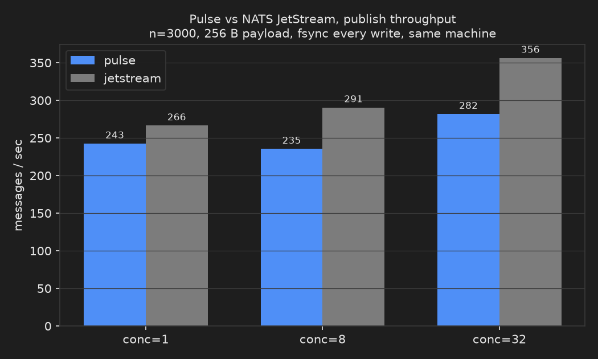

# Pulse

A single-node event broker with a durable, checksummed log, a gRPC API, a
CLI, and a public Go client, for services that need ordered replay without
running a cluster.

[](https://github.com/Yasser-Ameur/pulse/actions/workflows/ci.yml)
[](LICENSE)
[](go.mod)


## Try it

Docker is the only requirement. CI publishes the image on every push to
`master`:

```bash
docker run -d --name pulse -p 9090:9090 -p 9091:9091 -v pulse-data:/data ghcr.io/yasser-ameur/pulse:latest
curl http://127.0.0.1:9091/healthz    # 200
```

The CLI is not published on its own yet, so build it the way this repo's own
gate does, from a clone, against the broker you just started (on Windows Git
Bash, prefix any `docker` command that mounts a path with `MSYS_NO_PATHCONV=1`):

```bash
git clone https://github.com/Yasser-Ameur/pulse.git && cd pulse
docker run --rm -v "$(pwd):/src" -w /src \
  -e GOFLAGS=-mod=mod --add-host=host.docker.internal:host-gateway \
  golang:1.26 bash -c '
    go build -o /tmp/pulse-cli ./cmd/pulse-cli
    /tmp/pulse-cli --addr host.docker.internal:9090 topics create shipment-events
    /tmp/pulse-cli --addr host.docker.internal:9090 publish shipment-events \
      --key order-4471 --message "{\"status\":\"packed\"}"
    /tmp/pulse-cli --addr host.docker.internal:9090 subscribe shipment-events \
      --consumer fulfillment-worker
  '
```

That last block, run this session, printed:

```
created topic shipment-events (1 partitions)
published offset 0
0	2026-09-02T15:03:25Z	{"status":"packed"}
```

Every command above and in the rest of this README was run this session on
this machine; the exact output is in [docs/readme-trace.md](docs/readme-trace.md).

## Status

**Phase 1 (core broker)**: single-node broker with a durable segment log,
topics, publish/subscribe with acknowledgements, a gRPC API, a CLI, and a
full test suite. `ghcr.io/yasser-ameur/pulse:latest` is rebuilt by CI on
every push to `master` and carries that commit in its
`org.opencontainers.image.revision` label; no tag is pushed and no GitHub
release with binaries exists yet. See [docs/Roadmap.md](docs/Roadmap.md) for
what Phase 2 adds.

## Guarantees

Pulse delivers each record **at-least-once**, ordered **totally within a
partition**, and deduplicated **nowhere**: **consumers must be idempotent**.
A consumer that crashes between processing a record and acknowledging it
sees that record again on resume.

A stored cursor is the **next** offset to consume, not the last one
consumed: after processing offset `N`, acknowledge `N+1`.

Publishes are acknowledged after fsync under the default `sync-mode:
every-write`, and before fsync under `sync-mode: interval` (losing up to
`sync-interval` on a machine crash). Independently of the mode, a record can
be delivered before it is durable: there is no high watermark in the log.

Not provided: exactly-once delivery, clustering, replication, consumer
groups, and per-topic authorization (any valid token can do everything).
TLS and token authentication are provided.

[docs/Guarantees.md](docs/Guarantees.md) states each of these precisely,
names the code that implements them, and lists what Pulse does not give you.

## Highlights

- **Durable by default.** Under `sync-mode: every-write`, publishes are
  acknowledged only after fsync; torn writes recover by CRC-32C-validated
  truncation. `sync-mode: interval` trades that for throughput.
  [Guarantees.md](docs/Guarantees.md) section 2.
- **Deterministic shutdown.** SIGTERM cancels live followers with
  `codes.Unavailable` before `GracefulStop`, so an in-flight subscribe exits
  with a clear error instead of hanging; the monitor listener stays up
  through the whole sequence (`internal/server/server.go:171-174`).
- **Separate monitor listener** (default `127.0.0.1:9091`, one config key
  away from disabled) serves `/healthz`, `/readyz`, `/varz`, and
  `/metrics`, so a probe or a Prometheus scrape never touches the data
  plane. [Configuration.md](docs/Configuration.md).
- **TLS and mTLS**: `tls.cert-file`/`tls.key-file` for server TLS,
  `tls.client-ca-file` for client certificate verification; `pulse-cli`
  takes `--tls-ca`, `--tls-cert`, `--tls-key`.
- **Token authentication**, off by default with a startup warning
  (`internal/server/server.go:103`): `auth.tokens` / `auth.token-file` /
  `PULSE_AUTH_TOKENS` require a bearer token on every RPC once set. Health
  and reflection stay open either way.
- **Multi-partition topics**, 1 to 256 per topic
  (`internal/domain/topic/topic.go:27`), each with its own order and
  cursor; `client.PartitionForKey` routes by key on the caller's side.
- **Log compaction**: a `compact` topic keeps only the newest record per
  key, tombstones deletes, never renumbers offsets, and rewrites sealed
  segments with a crash-safe copy-and-swap
  (`tests/integration/compaction_test.go`).
- **A public Go client**, `pkg/client`, with full-jitter retry on
  `Unavailable` and transparent `Subscribe` resume
  (`pkg/client/backoff_test.go:32-81`), module path `github.com/Yasser-Ameur/pulse`
  (`go.mod:1`) matching the repository host: `go get github.com/Yasser-Ameur/pulse/pkg/client`.

## Usage

Create a topic, publish keyed JSON records, and read them back:

```bash
pulse-cli topics create shipment-events
pulse-cli publish shipment-events --key order-4471 --message '{"status":"packed"}'
pulse-cli publish shipment-events --key order-4471 --message '{"status":"shipped"}'
pulse-cli subscribe shipment-events --consumer fulfillment-worker
```

Watch new records as they arrive instead of reading what already exists:

```bash
pulse-cli subscribe shipment-events --follow --consumer fulfillment-worker
```

Or drive it from Go with the public client:

```go
c, err := client.Dial("127.0.0.1:9090")
if err != nil {
    log.Fatal(err)
}
defer c.Close()

ctx := context.Background()
if _, err := c.Publish(ctx, "shipment-events", 0, client.Message{
    Payload: []byte(`{"status":"packed"}`),
}); err != nil {
    log.Fatal(err)
}

err = c.Subscribe(ctx, "shipment-events", 0, client.SubscribeOptions{Consumer: "fulfillment-worker"},
    func(r client.Record) error {
        fmt.Println(r.Offset, string(r.Message.Payload))
        return nil
    })
```

Or bring up a broker plus Prometheus scraping it with Docker Compose:

```bash
docker compose -f examples/docker-compose.yaml up
```

See [examples/](examples/) for configs and runnable programs, and
[Client.md](docs/Client.md) for the full client reference.

## Benchmark

<picture>
  <source media="(prefers-color-scheme: dark)" srcset="assets/bench-dark.png">
  <source media="(prefers-color-scheme: light)" srcset="assets/bench-light.png">
  
</picture>

Pulse against NATS JetStream, same paired harness
(`bench/harness.go`), one run this session: same machine, Docker Desktop,
both binaries and data on the container filesystem (not the Windows bind
mount, which slows fsync by an order of magnitude), 3000 publishes per
point, 256-byte payloads, `sync-mode: every-write` (fsync every batch) on
both sides.

| | conc=1 | conc=8 | conc=32 |
|---|---|---|---|
| pulse | 243 msg/s | 235 msg/s | 282 msg/s |
| jetstream | 266 msg/s | 291 msg/s | 356 msg/s |

This says the two are in the same class on this box under this one
configuration, nothing more: it is a single run, not an average, and a
second run on the same machine landed at 349/435/445 msg/s for Pulse while
keeping the same relative band against JetStream. Full numbers and command
in [docs/readme-trace.md](docs/readme-trace.md); reproduce with
[bench/README.md](bench/README.md).

## Repository map

| Path | Purpose |
|---|---|
| `api/proto/pulse/v1/` | Wire contract (protobuf sources) |
| `pkg/api/pulse/v1/pulsepb/` | Generated Go wire types |
| `cmd/pulse-server`, `cmd/pulse-cli` | Binaries |
| `internal/domain` | Pure domain model |
| `internal/application` | Ports, use cases, services |
| `internal/adapters` | gRPC handlers and CLI |
| `internal/infrastructure` | Storage engine, metadata store, config, logging, networking |
| `internal/server` | Composition root |
| `tests/integration/` | End-to-end in-process tests |
| `docs/` | Design documentation |

## Documentation

- [Guarantees.md](docs/Guarantees.md): delivery, durability, and non-goals
- [Repository.md](docs/Repository.md): layout and rules
- [Architecture.md](docs/Architecture.md): layers, domain model, extension points
- [Storage.md](docs/Storage.md): log format, indexes, recovery, retention
- [Protocol.md](docs/Protocol.md): gRPC contract and versioning
- [Concurrency.md](docs/Concurrency.md): goroutines, locks, shutdown
- [Configuration.md](docs/Configuration.md): every config key, TLS setup, monitor endpoints
- [Operations.md](docs/Operations.md): production shutdown, probes, metrics, limits, readiness checklist
- [Client.md](docs/Client.md): the public Go client and CLI TLS flags
- [Roadmap.md](docs/Roadmap.md): phase plan and extension points

## Development

With Go 1.26 installed the `Makefile` targets work directly; without it,
run them inside `golang:1.26` the way the trace does
([docs/readme-trace.md](docs/readme-trace.md) has the exact invocation):

```bash
make fmt              # gofmt
make lint             # golangci-lint
make test             # go test ./...
make test-race        # go test -race ./...
make coverage         # coverage report (coverage.out, coverage.html)
make coverage-check   # coverage report, failing below COVERAGE_FLOOR (65)
make image            # build the container image
```

CI (GitHub Actions) checks formatting, vets and lints, runs unit and
integration tests, runs them again with the race detector, enforces the
coverage floor, runs the bench harness, and builds both binaries
(`.github/workflows/ci.yml`).

## License

Apache License 2.0. See [LICENSE](LICENSE).
